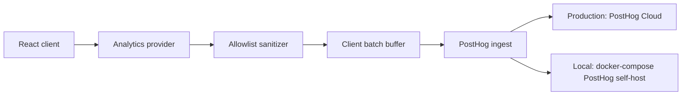

# Analytics Instrumentation Design

## 1. Overview and Motivation

Generated apps need analytics for product usage analysis, workflow friction discovery, and release-quality feedback. The design must preserve the generator's default behavior: analytics is disabled unless the app schema explicitly opts in.

The privacy promise is intentionally narrow:

- Analytics is opt-in at the app configuration level.
- Instrumentation captures interaction metadata, not user-entered content.
- Keyboard events never include printable characters.
- Form events never include field values.
- Every outbound property passes through an allowlist sanitizer before it reaches PostHog.

The backend is PostHog. Production uses PostHog Cloud. Local development uses a Docker-hosted self-host PostHog mirror with the same ingest schema and API shape. Current WSL2 environments do not have the Docker CLI installed, so local PostHog is documented as a prerequisite-driven setup rather than an immediately runnable command.

## 2. Architecture



Equivalent ASCII view:

```text
React client -> analytics provider -> allowlist sanitizer -> batch buffer -> PostHog ingest

Production: PostHog Cloud
Local:      docker-compose PostHog self-host
```

Environment variables:

```env
NEXT_PUBLIC_ANALYTICS_ENABLED=false
NEXT_PUBLIC_ANALYTICS_TOPOLOGY=embedded
NEXT_PUBLIC_POSTHOG_KEY=phc_or_local_project_key
NEXT_PUBLIC_POSTHOG_HOST=https://us.i.posthog.com
NEXT_PUBLIC_ANALYTICS_INGEST_ENDPOINT=/api/analytics/ingest
```

`NEXT_PUBLIC_POSTHOG_KEY` is the generated app's public project token. PostHog's current Next.js documentation names this value `NEXT_PUBLIC_POSTHOG_PROJECT_TOKEN`; the generator should use `NEXT_PUBLIC_POSTHOG_KEY` for the schema contract and map it to the SDK token argument. `NEXT_PUBLIC_POSTHOG_HOST` switches between PostHog Cloud and the local self-host endpoint. Empty schema `posthog_host` means use the production default selected by deployment environment.

Recommended SDK initialization:

```ts
posthog.init(process.env.NEXT_PUBLIC_POSTHOG_KEY!, {
  api_host: process.env.NEXT_PUBLIC_POSTHOG_HOST,
  defaults: "2026-01-30",
  autocapture: false,
  capture_pageview: false,
  capture_pageleave: false,
  disable_session_recording: true,
  before_send: sanitizePostHogEvent,
});
```

PostHog supports client-side initialization in Next.js via `instrumentation-client.ts`, public `NEXT_PUBLIC_` variables, and an SDK `before_send` hook. The design disables PostHog autocapture and pageview autocapture because this generated app must enforce its own privacy allowlist instead of relying on broad automatic capture.

Batching strategy:

- Keep a client-side queue inside the analytics provider.
- Flush every 5 seconds.
- Flush immediately at 25 events.
- Flush on `visibilitychange` when the document becomes hidden.
- Drop events when analytics is disabled or PostHog is uninitialized.
- Use `posthog.capture()` only after each event has passed the allowlist sanitizer.
- Keep only aggregate counters in the buffer for key count and focus/blur counts.

### Deployment topology: consumer and analytics separation

The instrumented generated app is the consumer app. The collection, storage, analysis, and visualization surface is the analytics app. This experiment may run both roles in the same generated system, but production should treat them as separable systems because analytics retention, access control, operations, cost management, and data governance are different concerns from the consumer app's OLTP workflow.

The design supports two topology modes without code changes:

| Mode | Use case | Consumer dependency | Analytics location |
| --- | --- | --- | --- |
| `embedded` / `same-system` | This experiment and small local demos | Consumer provider calls the local analytics adapter or same-origin ingest route. | Same generated app runtime, forwarding to local/self-host PostHog or cloud PostHog. |
| `separated` | Real operations where analytics is an independent system | Consumer provider calls a remote ingest API through the same adapter contract. | Separate analytics app or service that owns collection, storage, dashboards, and PostHog integration. |

The consumer app must not import analytics implementation details directly. It depends only on a generated `AnalyticsProvider` and an `AnalyticsAdapter` interface. The adapter is selected from config/env at startup. Switching from embedded to separated changes only environment variables or `x-analytics` settings, not generated UI code.

Topology environment variables:

```env
NEXT_PUBLIC_ANALYTICS_TOPOLOGY=embedded   # embedded | separated
NEXT_PUBLIC_ANALYTICS_INGEST_ENDPOINT=/api/analytics/ingest
NEXT_PUBLIC_ANALYTICS_ORIGIN_ALLOWLIST=https://app.example.com
```

### API boundary: ingest contract

The event ingest API is the only coupling point between consumer and analytics systems. The contract is identical in embedded and separated modes.

Endpoint:

- Embedded: `POST /api/analytics/ingest`
- Separated: `POST https://analytics.example.com/api/v1/events`

Authentication:

- Use a public project key for browser-origin event submission.
- Use an optional server-side write key only for server-mediated forwarding.
- Never expose management/admin PostHog keys to the consumer app.

Versioning:

- Include `schema_version`, starting with `"analytics.v1"`.
- The analytics app must accept known v1 events and reject unknown event names or fields.
- Breaking payload changes require a new version.

Payload envelope:

```json
{
  "schema_version": "analytics.v1",
  "project_key": "phc_or_local_project_key",
  "topology": "embedded",
  "events": [
    {
      "event_type": "click",
      "timestamp": "2026-06-02T00:00:00.000Z",
      "route": "/resource",
      "properties": {
        "element_id": "save-button",
        "role": "button",
        "aria_label": "Save"
      }
    }
  ]
}
```

CORS and origins:

- Embedded mode should prefer same-origin requests.
- Separated mode must allow only configured consumer origins.
- The analytics app should reject requests without an allowed origin, invalid key, invalid schema version, or disallowed event field.

Failure and retry behavior:

- Retry transient `429` and `5xx` responses with exponential backoff and jitter.
- Do not retry `400`, `401`, or `403`.
- Cap retry queue size and age.
- Drop expired events rather than blocking the consumer workflow.
- Never persist form values or printable keys in retry storage because such values should never enter the event object.

## 3. Privacy Guarantees

Privacy is enforced as a code-level contract, not only as a documentation statement.

Keyboard:

- `key_count` batches send only `count`, `route`, and `interval_ms`.
- `key_special` sends only an allowlisted `key_name`.
- Allowed key names: `Tab`, `Enter`, `Escape`, `ArrowUp`, `ArrowDown`, `ArrowLeft`, `ArrowRight`, `Backspace`, `Delete`.
- Printable characters are never sent.
- Raw `event.key` is never copied unless it exactly matches the allowed key set.

Clicks:

- Clicks send only `element_id`, `role`, `aria_label`, and `route`.
- Text content is never sent.
- CSS selectors, DOM paths, `innerText`, `textContent`, `value`, and `placeholder` are excluded.
- If an element has no stable `id`, `role`, or `aria-label`, the event may omit element fields rather than derive a risky label.

Forms:

- Form submit sends `form_id`, `success`, and `route`.
- Focus/blur uses counters or `field_id` only.
- Validation events send `field_id`, `error_type`, and `route`.
- Field values, default values, labels derived from visible text, option labels, uploaded filenames, and free-form validation messages are excluded.
- Error type must be normalized to a small enum such as `required`, `format`, `range`, `length`, `relation`, `custom`, or `unknown`.

Allowlist implementation:

```ts
const allowedPropertiesByEvent = {
  page_view: ["route", "prev_route", "timestamp"],
  click: ["element_id", "role", "aria_label", "route"],
  key_special: ["key_name", "route", "element_role"],
  key_count: ["count", "route", "interval_ms"],
  form_submit: ["form_id", "success", "route"],
  form_field_blur: ["field_id", "route"],
  validation_error: ["field_id", "error_type", "route"],
} as const;
```

Any event name not in the taxonomy is rejected. Any property not listed for that event is stripped. Any property value that is not a string, number, boolean, or null is stripped. Strings are length-limited before send. No sanitizer path should inspect or transform user-entered values because the correct behavior is exclusion, not redaction.

## 4. json_schema.yaml Configuration Schema

App-level opt-in uses a top-level extension key:

```yaml
# App-level analytics opt-in
x-analytics:
  enabled: false          # default: off
  topology: embedded      # embedded | separated
  posthog_host: ""        # empty = deployment default / PostHog Cloud
  ingest_endpoint: ""     # empty = default endpoint for topology
```

Recommended expanded shape for future phases:

```yaml
x-analytics:
  enabled: true
  topology: separated
  posthog_host: ""
  ingest_endpoint: "https://analytics.example.com/api/v1/events"
  project_key_env: "NEXT_PUBLIC_POSTHOG_KEY"
  origin_allowlist:
    - "https://consumer.example.com"
  events:
    page_view: true
    click: true
    key_special: true
    key_count: true
    form_submit: true
    form_field_blur: true
    validation_error: true
```

Granularity options:

| Granularity | Description | Recommendation |
| --- | --- | --- |
| App-level | One top-level `x-analytics.enabled` controls all instrumentation. | Use for Phase 1 because it is simple, backward-compatible, and easy to review. |
| Per-entity | Entity definitions can override analytics settings. | Defer. It adds schema complexity and makes privacy review harder. |
| Per-event-type | Top-level `events` flags control which event families are active. | Add after the provider is proven; useful for disabling keyboard or form instrumentation independently. |

Backward compatibility:

- Missing `x-analytics` means analytics disabled.
- Missing `enabled` means disabled.
- Missing `events` means use the default event map only when `enabled: true`.
- Empty `posthog_host` means use deployment environment defaults.
- Missing `topology` means `embedded`.
- Empty `ingest_endpoint` means use the default endpoint for the selected topology.
- Existing schemas generate identical code until `x-analytics.enabled` is true.

Generator read path:

```py
analytics = schema.get("x-analytics") or {}
analytics_enabled = bool(analytics.get("enabled", False))
analytics_topology = analytics.get("topology") or "embedded"
posthog_host = analytics.get("posthog_host") or ""
ingest_endpoint = analytics.get("ingest_endpoint") or ""
```

The generator conditionally emits analytics environment defaults and includes the analytics provider only when `analytics_enabled` is true. If disabled, it should avoid importing PostHog SDK code into the client bundle.

## 5. Event Taxonomy

| Event Type | Trigger | Payload Fields | Excluded |
| --- | --- | --- | --- |
| `page_view` | Route change | `route`, `prev_route`, `timestamp` | Query values that may contain content |
| `click` | User click | `element_id`, `role`, `aria_label`, `route` | Text content, DOM path, CSS selector, form value |
| `key_special` | Keydown for navigation/special keys only | `key_name`, `route`, `element_role` | Printable character value |
| `key_count` | Keydown batch | `count`, `route`, `interval_ms` | Any key info |
| `form_submit` | Form submit completed | `form_id`, `success`, `route` | Field values, submitted payload |
| `form_field_blur` | Field blur | `field_id`, `route` | Value, label text, placeholder |
| `validation_error` | Field validation error | `field_id`, `error_type`, `route` | Value, full error message |

Naming conventions:

- Use lowercase snake_case event names.
- Use stable route patterns where possible, not raw URLs with arbitrary query strings.
- Use generated schema field names for `field_id`.
- Use generated form identifiers such as `resource.edit` or `booking.new`.
- Use boolean `success` for submit outcome.

Route handling:

- Strip locale prefix only if the app already treats locale as a separate dimension.
- Drop query strings by default.
- Preserve route path parameters as route templates when the router exposes them; otherwise use the current pathname without search params.

## 6. Local Development Environment

Local PostHog mirrors the production ingest contract but runs on developer-managed infrastructure.

Example placeholder file:

```yaml
# docker-compose.posthog.yml
services:
  posthog:
    image: posthog/posthog:latest
    ports:
      - "8000:8000"
    environment:
      SITE_URL: "http://localhost:8000"
      SECRET_KEY: "replace-me-for-local-only"
    volumes:
      - posthog-data:/var/lib/posthog

volumes:
  posthog-data:
```

This compose snippet is intentionally illustrative. PostHog self-hosting is a multi-service deployment, and the implementation phase must use the current official PostHog self-host instructions or repository-provided compose assets rather than assuming this minimal service is sufficient.

WSL2 Docker prerequisite:

- This WSL2 environment currently has no Docker CLI installed.
- Option A: Install Docker Desktop for Windows, enable the WSL2 backend, then enable integration for this WSL distribution.
- Option B: Install Docker Engine directly inside WSL2 if Docker Desktop is not acceptable.
- Verify with `docker --version` and `docker compose version` before attempting local PostHog.
- If Docker is unavailable, local analytics development should use PostHog Cloud test project credentials or keep analytics disabled.

Local env example:

```env
NEXT_PUBLIC_ANALYTICS_ENABLED=true
NEXT_PUBLIC_POSTHOG_KEY=phc_local_project_key
NEXT_PUBLIC_POSTHOG_HOST=http://localhost:8000
```

Production env example:

```env
NEXT_PUBLIC_ANALYTICS_ENABLED=true
NEXT_PUBLIC_POSTHOG_KEY=phc_cloud_project_key
NEXT_PUBLIC_POSTHOG_HOST=https://us.i.posthog.com
```

## 7. Generator Integration

Relevant touch points:

| Area | Files or templates | Role |
| --- | --- | --- |
| Schema parsing | `code_generator/build_context.py`, `code_generator/generators.py` | Read `x-analytics`, validate defaults, expose analytics context. |
| Root provider | `app/layout.tsx` or `app/[locale]/providers.tsx` template if introduced | Wrap the app in an analytics provider when enabled. |
| Client provider | New generated or standard component such as `components/_standard/AnalyticsProvider.tsx` | Queue, sanitize, and dispatch events. |
| Route events | App router hooks inside provider | Emit `page_view` on route change. |
| Click events | Provider-level delegated listener | Emit safe click metadata. |
| Key events | Provider-level delegated listener | Emit `key_special` and aggregate `key_count`. |
| Form events | Provider-level delegated listeners plus generated form IDs | Emit submit, blur, and validation metadata. |
| Form templates | `code_generator/templates/form_upsert.tsx.jinja2`, `form_validation.ts.jinja2`, `form_view.tsx.jinja2` | Add stable `data-analytics-form-id` and `data-analytics-field-id` attributes only if needed. |
| List/detail templates | `page_list.tsx.jinja2`, `page_view.tsx.jinja2`, `page_new.tsx.jinja2`, `page_edit.tsx.jinja2` | Provide stable route/form identifiers if the provider cannot infer them. |

Option A: Generated code injection

- Instrumentation hooks are embedded directly into generated component files.
- Pros: precise per-form and per-field context is easy to emit.
- Cons: increases template complexity, duplicates event logic, and raises the risk that generated code captures content accidentally.

Option B: Runtime provider wrap

- A single client provider listens for route, click, key, and form lifecycle signals.
- Generated templates add only stable metadata attributes where the provider needs schema context.
- Pros: one privacy sanitizer, one queue, less template churn, easier QC.
- Cons: requires careful delegated-event logic and may need small template additions for stable IDs.

Recommendation: choose Option B. The runtime provider keeps analytics behavior centralized and reviewable. Generated code should only expose safe identifiers, never perform direct PostHog calls. This is cleaner for a generator because generated files are regenerated often and should not become the home for privacy-critical logic.

## 8. Phased Rollout Plan

Phase 1: Configuration and no-op provider

- Add `x-analytics` parsing with default disabled behavior.
- Add schema tests proving absent key and `enabled: false` generate the same output as before.
- Add a no-op analytics provider scaffold.
- Add local Docker setup documentation, including WSL2 prerequisite.
- No event emission yet.

Phase 2: Client instrumentation for page views and clicks

- Add PostHog SDK dependency and initialization behind opt-in config.
- Implement `page_view` on route changes.
- Implement delegated `click` capture with metadata allowlist.
- Add sanitizer tests for event/property rejection.
- Add generated IDs or attributes only where necessary.

Phase 3: Key and form lifecycle events

- Add `key_count` batching.
- Add `key_special` for the approved special keys only.
- Add form submit, blur, and validation error metadata.
- Add tests proving printable key values and form values are never sent.

Phase 4: Cloud integration and environment switching

- Add production PostHog Cloud environment documentation.
- Add local self-host environment documentation.
- Add deployment checklist for key/host values.
- Add smoke tests for disabled analytics, local host, and cloud host configuration.

Batch Processing Protocol:

- Each phase is a separate implementation command.
- Phase 1 must pass QC before Phase 2 begins.
- Phase 2 batch one should cover one representative generated entity before broad rollout.
- Failed QC stops rollout until root cause is fixed and reviewed.

## 9. Risks and Open Questions (Policy Decisions Recorded)

### Resolved Policy Decisions (2026-06-02)

| Policy | Decision |
|--------|----------|
| Consent scope | All users. Show opt-in to every user; honour opt-out; send nothing before consent. |
| Identity attachment | Both login user (distinct_id) and tenant (group). IDs only; no PII content. |
| Data retention | 30 days. |
| Query string handling | Always drop. Never include query strings in route or page_view payloads. |
| PostHog Cloud region | US. |
| Session recording / heatmaps / surveys / feature flags / autocapture | All disabled. Click tracking uses manual delegated capture with metadata allowlist only. |
| Policy constants | All of the above values must be implemented as central policy constants/config module (not scattered hardcoded values), to allow future x-analytics config integration. |

### Remaining Risks

- Client-side batching may add memory overhead or lose events during abrupt navigation.
- Offline or server-failure retry logic can create duplicate events unless bounded.
- PostHog Cloud cost depends on generated app usage volume and enabled event types.
- Self-hosted PostHog carries infrastructure and data-loss risk; PostHog states self-host users manage their own infrastructure and assume operational risk.
- Broad delegated listeners can accidentally collect more than intended if the sanitizer is bypassed.
- Validation error handling can leak content if full error messages are sent instead of normalized error types.

References:

- PostHog Next.js documentation: https://posthog.com/docs/libraries/next-js
- PostHog JavaScript configuration: https://posthog.com/docs/libraries/js/config
- PostHog self-host documentation: https://posthog.com/docs/self-host
- Docker Desktop WSL2 backend documentation: https://docs.docker.com/desktop/features/wsl/
